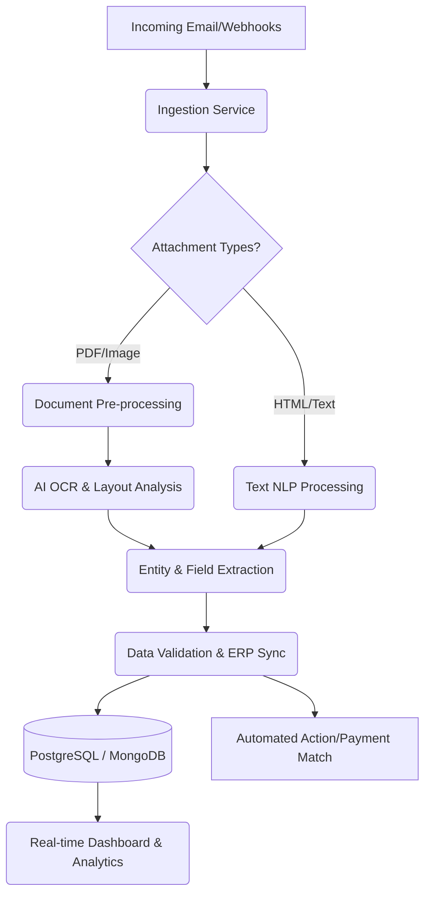

# AI Email Finance Agent
## Intelligent Email-Based Financial Automation Platform

**Author:** Project Specification  
**Version:** 2.0 (Expanded & Enriched)  
**Date:** 2026  

---

## 1. Executive Summary

This document details the architecture, design, and technical specifications of the **AI Email Finance Agent**, a fully autonomous, AI-powered system capable of organizing, extracting, and reconciling financial information directly from incoming email communications. 

The platform acts as an intelligent digital financial assistant. It seamlessly ingests emails, identifies financial documents (invoices, receipts, contracts), extracts granular data, cross-references internal databases natively, tracks expenses, monitors real-time cash flow, and handles complex tax tracking. By converting traditional conversational interfaces (email) into structured, queryable data pipelines, the platform aims to establish a zero-touch financial management ecosystem.

---

## 2. Problem Statement & Motivation

Modern businesses process immense volumes of transactional data through unstructured channels, primarily email. Critical financial elements—such as invoices, receipts, payment notices, tax documents, and customer credit inquiries—are scattered across individual employee inboxes, shared mailboxes, and obscure attachments.

**Key pain points include:**
- **Data Fragmentation:** Financial truth is distributed rather than centralized.
- **Manual Overhead:** High labor costs associated with manual data entry, classification, and reconciliation.
- **Error Propensity:** Human-in-the-loop data entry leads to missed payments, duplicate invoices, and erroneous tax reporting.
- **Delayed Visibility:** The latency between receiving a document and its reflection in accounting tools hinders real-time cash flow monitoring and strategic forecasting.

The AI Email Finance Agent resolves these bottlenecks by intelligently automating the extraction-to-reconciliation pipeline.

---

## 3. System Overview & Core Capabilities

The architecture is built on a distributed, event-driven microservices model, ensuring high availability and scalable processing. The core pipeline consists of six major macro-services:

1. **Email Ingestion & Event Monitoring:** Real-time data capture across various protocols.
2. **Document Processing & Pre-processing:** Image optimization and normalization for structural analysis.
3. **AI Classification & Extraction Engine:** Contextual NLP, Computer Vision, and OCR processing.
4. **Financial Validation & Reconciliation Engine:** Pattern matching, ERP syncing, and logic processing.
5. **Data Storage & Warehousing:** Multi-modal database architecture for both unstructured sources and relational data.
6. **Analytics & Visualization Layer:** Real-time metrics, cashflow monitoring, and interactive reporting.

---

## 4. Enhanced Technology Stack

**Backend & Integration Layer:**
- **Language:** Python 3.12+ (for ML/Backend), Node.js (for Websockets/BFF)
- **Frameworks:** FastAPI (High-performance API), Celery (Distributed task queue), LangChain / LlamaIndex (LLM Orchestration)
- **Event Bus:** Apache Kafka or RabbitMQ (High throughput message brokering)

**Artificial Intelligence & ML:**
- **OCR Engine:** EasyOCR, PaddleOCR, AWS Textract (Cloud fallback)
- **Document AI:** LayoutLMv3, Donut, DocFormer (Multimodal visual-text understanding)
- **NLP & LLM:** GPT-4 Turbo / Claude 3.5 Sonnet (for complex entity extraction and reasoning), local HuggingFace models for secure PII parsing.
- **Vector Database:** Pinecone, Qdrant, or Milvus (for semantic search of historical invoices)

**Data Infrastructure:**
- **Relational DB:** PostgreSQL 16 (Structured financial ledgers, User configurations)
- **Document DB:** MongoDB (Storing raw email JSONs, Base64 attachments, semi-structured outputs)
- **Cache & State:** Redis (Session management, rate limiting, and real-time dashboard state)

**Frontend & Presentation:**
- **Framework:** Vite + Vue 3 or React 18
- **Styling:** TailwindCSS, Headless UI (Premium, glassmorphism-enabled aesthetics)
- **Data Visualization:** D3.js, Chart.js, Recharts

**Infrastructure & DevOps:**
- **Containerization:** Docker & Kubernetes (K8s)
- **IaC:** Terraform
- **CI/CD:** GitHub Actions / GitLab CI
- **Observability:** Prometheus, Grafana, Datadog

---

## 5. High-Level Event Flow

---

## 6. Email Ingestion Layer

The system supports robust, multi-protocol ingestion, extending beyond standard IMAP to support modern enterprise authentication and APIs.

**Capabilities:**
- **OAuth2 Integration:** Support for Microsoft Graph API (Office 365) and Google Workspace API for secure, token-based, consent-driven access.
- **Real-Time Webhooks:** Utilizing push notifications (e.g., Google Pub/Sub or Microsoft Webhooks) to trigger immediate processing, eliminating polling delays.
- **Attachment Pre-filtering:** Signature removal, rejection of malware/executables, and dropping of irrelevant embedded images (e.g., social media icons in footers).

---

## 7. Document Processing & Pre-processing Layer

To ensure maximum accuracy from downstream ML models, attachments pass through a rigorous pre-processing pipeline.

- **Format Normalization:** Conversion of proprietary formats, HEIC, HTML, and Word documents to a standard PDF/Image format.
- **Computer Vision Improvements:**
  - **Deskewing:** Correcting rotated or misaligned scanned documents.
  - **Binarization & Denoising:** Enhancing contrast and removing background noise/watermarks.
  - **Multi-page Handling:** Splitting lengthy documents and intelligently identifying which pages contain structured financial tables vs. terms & conditions.

---

## 8. AI Extraction Engine

The AI Extraction Engine leverages multimodal models to understand the *spatial layout* in addition to the text. 

**Extracted Entities (Granular):**
- **Header Data:** Vendor Name, Tax ID (EIN/VAT), Invoice Number, PO Number, Issue Date, Due Date.
- **Line Item Data:** Item description, Quantity, Unit Price, Line Total, Discount Applied (requires Table Extraction mechanisms).
- **Footer Data:** Subtotal, Tax Amount (Broken down by percentage rate), Shipping Costs, Total Amount, Currency (ISO 4217), Payment Terms (e.g., Net 30), Bank Details (IBAN/SWIFT).

**Methodology:**
1. **Layout Parsing:** Models like LayoutLM recognize the visual structure and bounding boxes of tables.
2. **Contextual LLM Parsing:** A large language model handles variable structures (e.g., extracting "Due upon receipt" and converting it to a hard datetime object based on the issue date).

---

## 9. Financial Classification & Ontology Engine

Once data is extracted, it must be mapped to the company's Chart of Accounts (CoA).

**Categorization Strategy:**
- **Supervised ML Classification:** Categorizing expenses (e.g., "AWS" -> IT Infrastructure, "Delta Airlines" -> Travel).
- **Contextual Signals:** Utilizing the email body context. (e.g., An email saying "Here is the bill for the team lunch" contextualizes a generic restaurant receipt).
- **Document Typology:** Strict separation between Accounts Payable (Invoices received), Accounts Receivable (Payments to be collected), Credit Notes, and Bank Statements.

---

## 10. Payment Matching & Reconciliation Engine

The true value of the system lies in its ability to automate the reconciliation process, normally done entirely manually.

- **2-Way & 3-Way Matching:** The system matches an incoming Invoice against an internal Purchase Order (PO). If a delivery receipt is present in the database, it performs a 3-way match.
- **Automated Payment Verification:**
  - **Inputs:** Invoice Data + Bank Notification Email / Payment Gateway Webhook (Stripe/PayPal).
  - **Logic:** Matches exact amounts, approximate dates, and reference numbers. Marks the invoice status as "PAID" in the database.
- **Anomaly Detection:** Flags duplicate invoices or mismatches between quoted amount and billed amount, pushing these to a "Human-In-The-Loop" (HITL) manual review queue.

---

## 11. Global Tax & Compliance Engine

The engine is built to support international tax regulations, specifically handling complexities like European Value Added Tax (VAT/IVA).

- **Tax Extraction:** Identifies different tax brackets applied within the same invoice (e.g., basic rate, reduced rate, zero rate).
- **Vendor Validation:** Automatically checks the extracted VAT number against the VIES (VAT Information Exchange System) API to verify vendor legitimacy.
- **Automated Ledger Generation:** Prepares real-time summaries for tax season, calculating Total VAT Paid vs. Total VAT Collected (VAT Balance).

---

## 12. System Integration & Extensibility

The tool does not exist in a vacuum; it acts as a central hub synchronizing via API with existing business tools.

- **ERP & Accounting Sync:** Bi-directional sync with QuickBooks Online, Xero, NetSuite, or SAP.
- **CRM Integration:** Syncing client payments to their respective profiles in Salesforce or HubSpot.
- **Banking APIs:** Direct integration with Plaid or Open Banking APIs to match email receipts against real bank feed transactions.

---

## 13. Data Storage Architecture

A highly reliable, decoupled data strategy ensures both speed and auditability:

1. **Transactional Database (PostgreSQL):** Stores clean, normalized data. (Users, Tenants, Invoices, Workflows, Audit Logs). Used to enforce referential integrity.
2. **Document Store (MongoDB):** Retains unstructured JSON blobs from LLM extraction, allowing schema evolution without database migrations.
3. **Blob Storage (AWS S3 / Azure Blob):** Secured, encrypted-at-rest storage for raw attachments and normalized PDFs.
4. **Caching Layer (Redis):** Manages API rate limits, WebSocket session states, and Celery task tracking.

---

## 14. Real-Time Processing & Dashboard Visibility

The dashboard acts as the command center for the financial controller.

**Infrastructure:** Data changes push events to Redis, which publishes them to the frontend via WebSockets/Server-Sent Events (SSE).
**UI/UX Panels:**
- **Macro Cash Flow Predictor:** Graphing current bank balance against upcoming due invoices.
- **Action Required Queue:** Visual interface for HITL review of low-confidence OCR reads.
- **Supplier Analytics:** Identification of highest spend vendors, late payment trends, and geographic expense distribution.

---

## 15. Security, Compliance & Governance

Financial data is PII (Personally Identifiable Information) and highly sensitive.

- **Encryption Architecture:**
  - **At Rest:** AES-256 encryption on all S3 buckets and database volumes.
  - **In Transit:** Strict TLS 1.3 enforced for all internal and external communication.
- **Data Minimization & Redaction:** Optional capability to securely redact credit card numbers or highly sensitive fields prior to storing logs.
- **Role-Based Access Control (RBAC):** Distinct permission tiers (e.g., Admin, Accountant, Read-Only Employee).
- **Audit Logging:** Immutably logging every action (e.g., "User X manually changed Invoice Y amount from $10 to $100").

---

## 16. Performance & Scalability Considerations

- **Horizontal Pod Autoscaling (HPA):** Kubernetes dynamically spins up new OCR and ML worker nodes when the email queue backlog exceeds defined thresholds (e.g., end-of-month invoice spikes).
- **Asynchronous Processing:** Using Celery ensures that the API gateway never blocks while waiting for a 10-page PDF to process. Webhooks handle eventual status delivery.

---

## 17. Future Expansion & AI Roadmap

The foundational architecture is designed to support advanced autonomous behaviors in the future:
1. **Predictive Cash Flow Analysis:** Deep learning models that forecast cash crunches based on historical seasonal payment delays.
2. **Automated Payouts:** Direct integration with corporate cards or bank APIs to automatically execute payments for verified, approved invoices on their due date.
3. **Conversational Financial Queries:** Allowing users to email the agent: *"How much did we spend on software in Q3?"* and receiving an automated, data-backed response.
4. **Vendor Fraud Detection:** AI modeling identifying anomalies in routing numbers or sudden, unexplained spikes in invoice amounts from known suppliers.

---

## 18. Conclusion

The AI Email Finance Agent redefines standard accounts payable and receivable workflows. By transitioning away from manual data entry toward a deterministic, secure, multi-modal AI extraction pipeline, organizations benefit from real-time visibility, near-zero error rates, and significantly reduced overhead. This platform acts not just as an OCR tool, but as a holistic, programmatic financial controller.
